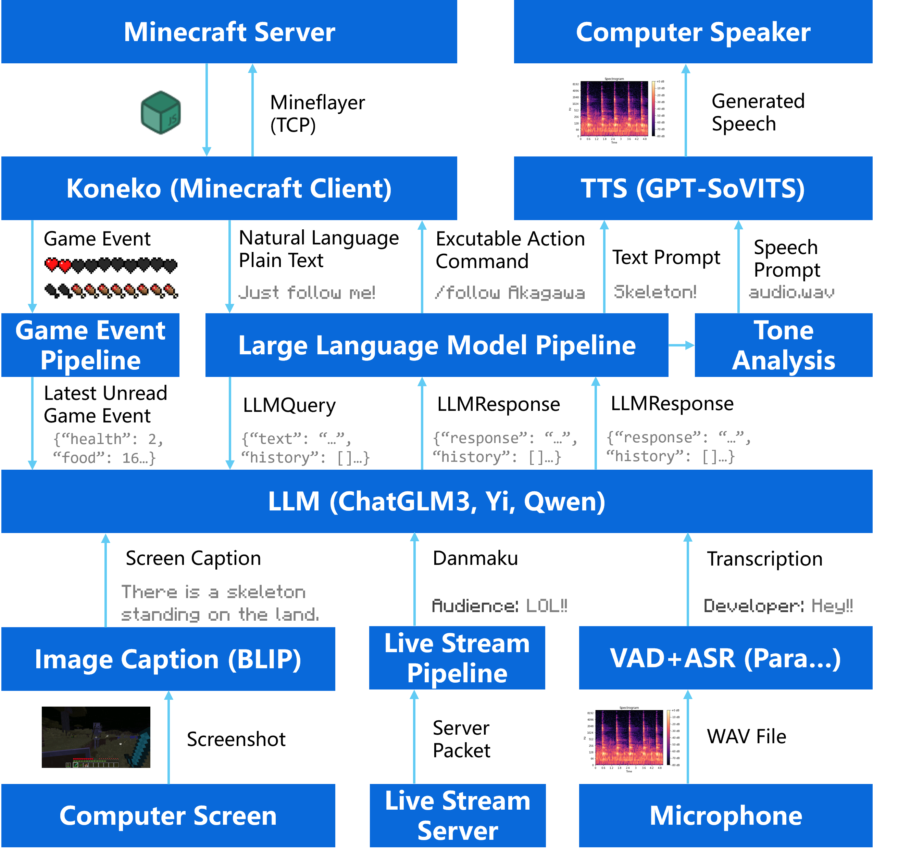

# Zerolan Live Robot

   

      

*Docs Languages: [简体中文](https://github.com/AkagawaTsurunaki/ZerolanLiveRobot/blob/main/README.md) | [English](https://github.com/AkagawaTsurunaki/ZerolanLiveRobot/blob/main/docs/en/README.md) | [日本語](https://github.com/AkagawaTsurunaki/ZerolanLiveRobot/blob/main/docs/ja/README.md)*

> 基于大语言模型、计算机视觉、语音合成、语音识别等人工智能技术的具有视、听、说多感知的 AI 游戏直播虚拟形象。

你或许已经听说过著名的 [Neurosama](https://virtualyoutuber.fandom.com/wiki/Neuro-sama)，或者是来自中国的[木几萌](https://mobile.moegirl.org.cn/%E6%9C%A8%E5%87%A0%E8%90%8C)。目前，越来越多的 AI VTuber 广泛地出现在 Twitch、Youtube、Bilibili 等平台，这些 AI VTuber 可以与直播间的观众互动、闲聊、看视频、打游戏等操作。同时，也有更多的公司正在基于 AI 等技术开发相关的直播机器人。这些虚拟形象通常覆盖了直播、游戏、娱乐等广泛的服务范围。

本人希望能让世界上每一个人，可在消费级显卡上部署一个 AI 虚拟形象，你可以将其作为自己的朋友、伴侣，或任何您想让 TA 成为的形象，融入您的日常生活，在赛博世界中永远陪伴着你。

## 项目功能

| 功能         | 描述                                                      |
|------------|---------------------------------------------------------|
| 纯文本对话      | 利用大语言模型，可以对环境做出响应，输出文本内容。                               |
| 带情感切换的语音对话 | 利用 TTS 模型和基于文本语气的提示词切换机制，可以根据输出文本内容和当前的心情合成带有语气的语音片段。   |
| 语音识别       | 利用 ASR 模型，可以识别来自现实环境中的人类声音。                             |
| 视觉识别       | 利用图像识别模型，可以根据来自指定窗口的截图，理解图像内容。                          |
| 直播平台接入     | 利用各大直播平台的 API，可以读取来自直播间的弹幕等信息。                          |
| 游戏智能体插件    | 目前支持 Koneko，可以与本项目一同使用用以连接 Minecraft AI 智能体，使其具有打游戏的功能。 |

## 支持模型

为了能够使更多的人可以在本地部署本项目，目前测试了一系列的开源人工智能模型。

### 大语言模型

| 模型名称                                                     | 语言支持    | 显存占用       | 描述     |
| ------------------------------------------------------------ | ----------- | -------------- | -------- |
| [THUDM/chatglm3-6b](https://huggingface.co/THUDM/chatglm3-6b) | ✅中 ✅英 ❌日 | 5.4 GB (4-bit) | 支持量化 |
| [Qwen/Qwen-7B-Chat](https://huggingface.co/Qwen/Qwen-7B-Chat) | ✅中 ✅英 ❌日 | 10 GB          | 支持量化 |
| [01-ai/Yi-6B-Chat](https://huggingface.co/01-ai/Yi-6B-Chat)  | ✅中 ✅英 ❌日 | 8.4 GB         |          |
| [augmxnt/shisa-7b-v1](https://huggingface.co/augmxnt/shisa-7b-v1) | ❌中 ✅英 ✅日 | 11.6 GB        |          |

### 文本转语音模型

| 模型名称                                                     | 语言支持    | 显存占用 | 描述                   |
| ------------------------------------------------------------ | ----------- | -------- | ---------------------- |
| [RVC-Boss/GPT-SoVITS](https://github.com/RVC-Boss/GPT-SoVITS) | ✅中 ✅英 ✅日 | 2.3 GB   | 语音克隆 \| 文本转语音 |

### 视觉模型

| 模型名称                                                     | 类型              | 显存占用 | 描述 |
| ------------------------------------------------------------ | ----------------- | -------- | ---- |
| [Salesforce/blip-image-captioning-large](https://huggingface.co/Salesforce/blip-image-captioning-large) | Image captionning | 1.1 GB   | -    |

### 自动语音识别模型

| 模型名称             | 语言支持     | 显存占用 | 描述 |
|------------------|----------|------|----|
| SpeechParaformer | ✅中 ✅英 ✅日 | -    |    |


## 模型组合选择

运行本项目，您需要有支持 CUDA 的显卡。下表为您展示了一些可能的组合，请根据您的显卡的显存大小，决定使用什么模型组合。以下数据已经过开发者的直播测试（测试时还有直播姬、Minecraft
Server 等程序在后台运行），仅供参考。当然您可以根据需要选择其他支持的模型。

| 组合 | Large Language Model       | Text to Speech | Image-Text Captioning       | OBS      | Minecraft        | 显存占用    |
|----|----------------------------|----------------|-----------------------------|----------|------------------|---------|
| 1  | ChatGLM3 (4-bit Quantized) | GPT-SoVTIS     | blip-image-captioning-large | 应用高质量编码器 | 1.20.4 无光影 默认材质包 | 10.9 GB |
| 2  | ChatGLM3 (4-bit Quantized) | GPT-SoVTIS     | blip-image-captioning-large | 应用高质量编码器 | -                | 9.3 GB  |
| 3  | ChatGLM3 (4-bit Quantized) | GPT-SoVTIS     | blip-image-captioning-large | -        | -                | 8.8 GB  |
| 4  | ChatGLM3 (4-bit Quantized) | GPT-SoVTIS     | -                           | -        | -                | 7.7 GB  |
| 5  | ChatGLM3 (4-bit Quantized) | -              | -                           | -        | -                | 5.4 GB  |

*注：这里的 ChatGLM3 是指参数量为 6B 的模型。*

开发者测试时的电脑配置如下，仅供参考。

| 设别名称    | 设备型号                           | 补充说明     |
|---------|--------------------------------|----------|
| Windows | Windows 11                     | -        |
| CPU     | i9-13900HX                     | 24 内核    |
| GPU     | NVIDIA GeForce RTX 4080 Laptop | 12 GB 显存 |
| 内存      | -                              | 32 GB 内存 |

此外您还需注意：

1. 多个程序同时抢占 GPU 资源可能导致服务响应中断。例如，OBS 在进行解码时对 GPU 的占用显著提高，从而导致 LLM 或 TTS
   服务被操作系统挂起。
2. 项目运行时可能会持续消耗显卡资源，请注意散热，避免引发火灾风险。
3. 上述数据在不同系统和硬件上可能存在差异，请注意留足冗余量。
4. 本项目尚不支持多卡运行，如果有需要您可以自行更改代码。## 模型组合选择

## 部署和运行

我们假定您已经正确地安装了 Anaconda 和 Python。

### 克隆仓库

确保您已经正确安装了 Git，然后执行以下指令，它将克隆本仓库到您的本机。

```shell
git clone https://github.com/AkagawaTsurunaki/ZerolanLiveRobot.git
```

### 安装依赖

首先，让我们使用 Anaconda 创建一个虚拟环境。

```shell
conda create --name zerolanliverobot python=3.10 -y # 创建虚拟环境
```

这将命令 Anaconda 创建一个名为`zerolanliverobot`的虚拟环境，且指定了 Python 版本为 3.10。

```shell
cd YourDirectory/ZerolanLiveRobot # 切换目录至本仓库的目录
conda activate zerolanliverobot # 激活刚刚创建的虚拟环境
pip install -r requirements.txt # 安装依赖
```

### 修改配置

您需要找到本项目中的配置文件`config/template_config.yaml`，将其**复制后重命名**为 `config.yaml`。

接下来，我们将会详细介绍配置文件中的每块内容，您需要按照注释和文档的要求修改配置项以适应您的环境。

#### 直播平台服务配置：`live_stream`

这项配置用于连接至指定平台的直播间服务器，并登录您的账号，获取指定直播间的内容。

```yaml
# 直播平台服务配置
live_stream:
  # 是否开启本服务。若为 False，则不会向对应的直播平台发起请求。
  enable: True
  # 支持的直播平台
  platforms:
    # Bilibili 平台配置
    - bilibili:
        # `sessdata`、`bili_jct`、`buvid3` 这三项用于
        # 向 Bilibili 服务器校验您的身份，如果不登录将无法获取直播间的弹幕信息。
        # 具体如何填写这三个值，
        # 详见[此处](https://nemo2011.github.io/bilibili-api/#/get-credential)。
        # 请注意，不要将这三项泄露给他人，尤其在直播的时候，这将会有盗号风险。
        sessdata:
        bili_jct:
        buvid3:
        # 是您要连接的直播间的ID，通常为直播间URL中的从左到右第一次出现的数字。
        # 当然，您可以设置为他人直播间的ID，这样会接受他人直播间的弹幕信息。
        room_id:
```

#### 截屏服务配置：`screenshot`

这一部分是为了让 ZerolanLiveRobot 可以识别当前画面中的的实时内容，你可以指定其可以看到的窗口，例如游戏画面。

```yaml
# 截屏服务配置
screenshot:
  # 是否开启本服务。若为 False，则不会截取电脑屏幕。
  enable: True
  # 代表要识别的窗口标题，您也可以不填全，
  # 这样会在自动匹配的窗口列表中选择第一个窗口进行观测。
  window_title: Minecraft
  # 缩放因子，它的作用是防止窗口的边框和标题栏被识别到，从而使 AI 失去沉浸感。
  # 取值越小，AI 可识别的范围越小，取值 0 ~ 1 之间。
  k: 0.9
  # 截取的图片存放目录，会保存为若干个`时间戳.png`这样的图片。
  # 程序停止不会自动清除这里的图片。
  save_directory: .tmp/screenshots
```

#### 图片字幕服务配置：`image_captioning`

这一部分是将图片转化为一段自然语言处理并交于 LLM 处理，您可以指定支持的模型。

```yaml
# 图片字幕服务配置
image_captioning:
  # 是否开启本服务。若为 False，则不会加载模型，禁用视觉信息来源。
  enable: True
  # 是否以 debug 模式开启服务
  debug: False
  # 服务地址
  host: 127.0.0.1
  # 服务端口
  port: 9879
  # 支持的图片字幕模型
  models:
    # [Salesforce/blip-image-captioning-large](https://huggingface.co/Salesforce/blip-image-captioning-large)
    - Salesforce/blip-image-captioning-large:
        # BLIP 模型的地址
        model_path: Salesforce/blip-image-captioning-large
        # BLIP 模型的文本提示词（必须是英文），
        # 例如当你使用`There `时，模型的输出就会以`There`开头。
        text_prompt: There
```

#### 文本转语音服务配置：`text_to_speech`

这一部分配置了 ZerolanLiveRobot 的文本转语音服务，用来使其发出对于的声音。

```yaml
# 文本转语音服务配置
text_to_speech:
  # 是否开启本服务。若为 False，则不会加载模型，禁用语音生成功能。
  enable: True
  # 是否以 debug 模式开启服务
  debug: False
  # 服务地址
  host: 127.0.0.1
  # 服务端口
  port: 9880
  # 生成的语音被保存的位置
  save_directory: .tmp/wav_output
  # 支持的文本转语音模型
  models:
    # [RVC-Boss/GPT-SoVITS](https://github.com/RVC-Boss/GPT-SoVITS)
    - RVC-Boss/GPT-SoVITS:
      # 如果你使用本项目，不需要进行多余的配置，但不要删除此字段。
```

如果您使用的模型是[RVC-Boss/GPT-SoVITS](https://github.com/RVC-Boss/GPT-SoVITS)，这是一个可以支持仅需3到10秒的音频克隆的模型。请移步至官方仓库，了解如何下载并使用该模型。

关于 GPT-SoVITS 官方的 API 如何支持中英、日英混读，请参考如下的[教程](https://github.com/jianchang512/gptsovits-api)修改。

请按照上述仓库中文档中的操作步骤配置 GPT-SoVITS 服务，并启动 API 服务，也请记住您的 API 服务的相关配置。

#### 大语言模型服务配置：`large_language_model`

这一部分是 ZerolanLiveRobot 的核心服务，主要用于情感分析、回应、处理游戏事件等目的。

```yaml
# 大语言模型服务配置
large_language_model:
  # 是否开启本服务。注意这个字段必须为 True。
  enable: True
  # 是否以 debug 模式开启服务
  debug: False
  # 服务地址
  host: 127.0.0.1
  # 服务端口
  port: 9881
  # 支持的大语言模型
  models:
    - THUDM/chatglm3-6b:
        # 模型地址
        model_path: THUDM/chatglm3-6b
        quantize: 4
    - Qwen/Qwen-7B-Chat:
        # 模型地址
        model_path: Qwen/Qwen-7B-Chat
        quantize: 4
        # bf16, fp16, cpu 或者 auto
        loading_mode: auto
    - 01-ai/Yi-6B-Chat:
        # 模型地址
        model_path: 01-ai/Yi-6B-Chat
        loading_mode: auto
    - augmxnt/shisa-7b-v1:
        # 模型地址
        model_path: augmxnt/shisa-7b-v1
        loading_mode: auto
```

#### 语气分析服务配置：`tone_analysis`

这一部分是为了让 ZerolanLiveRobot 的输出语音带有更加丰富的感情。

```yaml
# 语气分析服务配置
tone_analysis:
  # 是否开启本服务。如果设置为 True, LLM 服务和 TTS 服务必须也启动。
  enable: True
  # 语气分析模板的路径
  tone_analysis_template_path: template/tone_ayalysis_template.yaml
```

为了能让 ZerolanLiveRobot 以不同的语气说话，您需要在 `template/tone_analysis_template.yaml` 配置中修改自定义的Prompt。以下是一个示例。

```yaml
task:
  任务描述：
  你现在将要完成一个分析语句语气的任务，你只能从我给出的这些语气标签中选择合适的词描述语句所蕴含的情感。
  情感标签：平静、开心、生气。
  请注意，只输出情感标签，如果存在不文明和污秽语言，请直接输出“生气”。若不能判断请输出“平静”，严禁输出其他内容。
tone:
  # 情感 ID 表示此 Prompt 所包含的语气，例如“`开心`”、“`生气`”。
  # 请注意，根据您使用的大语言模型所支持的语言，来设定`EMOTION_ID`的效果可能会更好。
  平静:
    # 此 Prompt 音频文件的路径。
    refer_wav_path: 1.wav
    # 此 Prompt 音频文件中表述的内容。
    prompt_text: 嗯，意大利面和四十二号混凝土。
    # 此 Prompt 音频所用的语言。目前仅支持`zh`（中文）、`en`（英语）、`ja`（日语）这三国语言。
    prompt_language: zh
    examples:
      - 冷静分析，你说得很正确。
  # EMOTION_ID
  开心:
    refer_wav_path: 2.wav
    prompt_text: 哇！这是什么！太好看了吧！
    prompt_language: zh
    examples:
      - 哇！我们一起来玩吧！我今天心情超级好。
  # EMOTION_ID
  生气:
    refer_wav_path: 3.wav
    prompt_text: 气死我了，我要打你了哦。
    prompt_language: zh
    examples:
      - 气死人了，你到底在干什么啊？
```

#### OBS 服务配置：`obs`

这一部分将 ZerolanLiveRobot 的输出保存在文件中，以便作为字幕展示。

```yaml
# OBS 服务配置
obs:
  # 是否开启本服务。如果设置为 True, 将会把模型的输出写入到文件里供 OBS 读取。
  enable: True
  # 弹幕输出字幕文件。被选择读取到的弹幕会被输出到这个路径的文件中。
  danmaku_output_path: .tmp/danmaku_output/output.txt
  # 语气输出字幕文件。模型输出的语气会被输出到这个路径的文件中。
  tone_output_path: .tmp/tone_output/output.txt
  # 大语言模型输出字幕文件。模型输出的文字会被输出到这个路径的文件中。
  llm_output_path: .tmp/llm_output/output.txt
```

[OBS](https://obsproject.com/download) 是一款免费且开源的视频录制和直播软件。您需要设置字幕后，选择“从文件读取”。

#### 声音活动检测服务配置：`voice_activity_detection`

```yaml
# 声音活动检测服务配置
voice_activity_detection:
  # 是否开启本服务。如果设置为 True, 将会实时检测麦克风的声音。
  enable: False
  # 录制的音频文件存放位置。
  save_directory: .tmp/records
  # 每次读取音频数据的块大小。
  chunk: 4096
  # 音频采样率。
  sample_rate: 16000
  # 超过此阈值则被判定为有人说话。
  threshold: 600
  # 最大允许止息数。
  max_mute_count: 10
```

#### 自动语音识别服务配置：`auto_speech_recognition`

```yaml
# 自动语音识别服务配置
auto_speech_recognition:
  # 是否开启本服务。如果设置为 True, 那么声音活动检测服务配置也应该开启。
  enable: False
  # 是否以 debug 模式开启服务。
  debug: False
  # 服务地址。
  host: 127.0.0.1
  # 服务端口。
  port: 9882
  # 支持的自动语音识别模型
  models:
    - speech_paraformer:
        model_path:
        version: v2.0.4
```

#### Minecraft 服务配置：`minecraft`

这一部分依赖于 [Koneko](https://github.com/AkagawaTsurunaki/Koneko) 项目，用于操纵 Minecraft 中的智能体。

```yaml
# Minecraft 服务配置
minecraft:
  # 是否开启本服务。如果设置为 True, 
  enable: True
  # 是否以 debug 模式开启服务。
  debug: False
  # 服务地址。
  host: 127.0.0.1
  # 服务端口。
  port: 12546
```

#### ZerolanLiveRobot 配置：`zerolan_live_robot_config`

```yaml
# ZerolanLiveRobot 配置
zerolan_live_robot_config:
  # 是否开启控制器。必须为 True，否则网页端控制器无法使用。
  enable: True
  # 是否以 debug 模式开启服务。
  debug: False
  # 服务地址。
  host: 127.0.0.1
  # 服务端口。
  port: 9888
  # 角色扮演提示词路径。
  role_play_template_path: template/role_play_template.yaml
  # 全局语言设置。
  lang: en
```

对于角色扮演提示词模板，您可以在 `template/role_play_template.yaml` 中找到。

```yaml
# 这里是系统提示词
system_prompt:
  '''
  Here you should write system prompt.
  '''
# 这里规定了 ZerolanLiveRobot 读取环境信息的格式。history 和 format 中的格式需要保持一致。
format:
  {
    "开发者说": "This is what the developer says.",
    "弹幕":
      {
        "用户名": "Username of the danmaku sender.",
        "内容": "Content of the danmaku."
      },
    "游戏画面": "Real-time content in Minecraft gameplay",
    "游戏状态":
      {
        "生命值": "Indicates health points in Minecraft",
        "食物值": "Indicates food points in Minecraft",
        "环境": "Describes the surrounding environment in Minecraft"
      }
  }
# 这里用于使 LLM 代入场景，请根据实际需要调整。
# 其中第一条是给模型输入的部分，第二条是期待模型的回应，以此类推……
history:
  - {
    "开发者说": "This is what the developer says.",
    "弹幕":
      {
        "用户名": "Username of the danmaku sender.",
        "内容": "Content of the danmaku."
      },
    "游戏画面": "Real-time content in Minecraft gameplay",
    "游戏状态":
      {
        "生命值": "Indicates health points in Minecraft",
        "食物值": "Indicates food points in Minecraft",
        "环境": "Describes the surrounding environment in Minecraft"
      }
  }
  - "Here your should write something"
```

### 开始运行

首先，启动一系列的模型。

```shell
cd YOUR_WORKSPACE/ZerolanLiveRobot # 切换目录至本仓库的目录
conda activate YOUR_ENV # 激活可以支持该服务的 conda 环境
python service_starter.py --service asr # 启动自动语音识别进程
```

注意，由于不同的模型可能需要不同的依赖库，建议使用不同的 conda 环境隔离，防止发生依赖冲突。

每一次启动一个进程，您都应该创建一个新的终端。同理，您需要开启下列的服务进程。

```shell
python service_starter.py --service llm # 启动大语言模型进程
python service_starter.py --service ic # 启动图像字幕进程
python service_starter.py --service tts # 启动文字转语音进程
```

等待所有服务都启动成功后，请使用下列命令开启 ZerolanLiveRobot 主进程。

```shell
cd YourDirectory/ZerolanLiveRobot # 切换目录至本仓库的目录
conda activate zerolanliverobot # 激活刚刚创建的虚拟环境
python main.py # 启动主程序
```

如果一切正常，稍后就能听到合成的语音被自动播放了（注意系统音量，不要损伤您的听力）。

## 常见问题

### Cuda Out of Memory

出现这种情况，意味着当前加载的模型已经超过了您的 GPU 资源的限制。可能的解决方案：

1. 以量化模式使用模型。
2. 使用占用显存更低的模型组合。
3. 禁用某些占用 GPU 资源的应用或进程。
4. 更换具有更大显存的 GPU。

### 我没有说话，但却意外地捕获到了有人在说话，怎么回事？

ZerolanLiveRobot 会默认自动播放合成后的语音，
如果您选择外放，可能会导致将自己发出的声音误认为是您或其他用户发出的声音。
所以，请注意不要将麦克风和扬声器放置在过近的位置，可以尝试调小系统音量，或者选择佩戴耳机等。

### 无法找到窗口

```
WARNING  | scrnshot.service:screen_cap:32 - 无法找到窗口 xxx
```

如字面意思，程序无法找到您在配置文件中设置的 `screenshot_config.win_title` 所指定的窗口。请检查您对应的窗口确实开启了，或者是否存在拼写错误。

## 背景

> 本节是对本项目的由来的阐述，可以更好地让您了解项目的成长过程。

2022 年末至 2023 年初，此时正值人工智能模型，尤其是大语言模型的爆火时期，我也有幸体验到了诸如 [ChatGPT](https://openai.com/chatgpt) 等基于大语言模型的应用。虽然其具有一定逻辑和专业知识的对话体验深深震撼了我，然而当时的我却没有意识到这其实是虚拟主播世界的一次基于人工智能变革的前夕。

在 2023 年，本人第一次接触到 [Neurosama](https://virtualyoutuber.fandom.com/wiki/Neuro-sama) 的时候，为其可爱的外表、有趣的对话和行为所吸引。在观看了相当一部分的切片视频后，我越发对其背后的实现机理和架构着迷，于是在2023 年末，我开启了第一次的尝试，并将此项目命名为 LingController。

无论是从直播间读取弹幕等信息，还是获取现实世界中人类发出的语音，对于大语言模型来说，无非是将一段文字转换为另一段文字。因此，不难想到将大语言模型作为整个项目的核心模块。通过语音识别模块，我们可以将一段来自外界的语音转录为一段纯文本，并将其输入给大语言模型，而大语言模型的输出文字将会被传递给一个文字转语音模型。

在当时，鉴于 GPU 的局限性，我选择了 [THUDM/ChatGLM2-6B](https://github.com/thudm/chatglm2-6b) 作为大语言模型，和当时较为有潜力的文本转语音模型 [Plachtaa/VALL-E-X](https://github.com/Plachtaa/VALL-E-X)（此模型结构原为微软提出），以及百度[飞桨PaddlePaddle](https://www.paddlepaddle.org.cn/) 的一个自动语音识别模型。

大概耗时数周，LingController 最终可以运行，但是存在诸多问题：

1. 由于大语言模型开启量化后精度损失而造成的胡言乱语、言不达意。
2. 合成语音存在频发的吞字、漏字、不清晰以及严重的第二语言问题。
3. 作为一个实验项目，LingController 并没有优良的架构设计。

在 2024 年，全新的语音合成模型的出现，和越来越多的开源大语言模型的应用，使我重新对项目进行了更改。同时为了更好地支持开源社区，我重新创建了这个名为 [AkagawaTsurunaki/ZerolanLiveRobot: An AI game live streaming virtual character based on LLM, CV, TTS, and ASR technologies, with multi-sensory capabilities of seeing, hearing, and speaking. (github.com)](https://github.com/AkagawaTsurunaki/ZerolanLiveRobot) 的开源项目，并且增加了更多的功能。

在发布了 Zerolan Live Robot 的第一个版本后，我很快意识到了其它问题。

1. 不同的开源仓库或模型使用了不同的接口设计方案，这导致各个模型的信息流交互会随着模型的增加越来越困难。

2. 未来可能会支持更多的游戏智能体，而不局限于 Minecraft。

为了方便开发，我设计了一套通用管线用以处理各个模型之间的交互流，同时将 Minecraft AI 智能体作为一个单独的开源项目 [AkagawaTsurunaki/Koneko: AI Minecraft agent based on mineflayer and LLM. Related to ZerolanLiveRobot. (github.com)](https://github.com/AkagawaTsurunaki/Koneko)。我们希望这种管线数据流的模型交互框架可以适用于更多的 AI 模型，以便能为您提供更加多样复杂的底层模型组合和交互方法，最终达成打造更加个性化的交互机器人解决方案。

## 设计思路

> 本节介绍 ZerolanLiveRobot 的整体架构。

ZerolanLiveRobot 作为一个基于多种人工智能的级联系统，我们将视其为一种可以与周围环境交互并进行自我迭代的智能体。

### 管线

具体地说，对于 Zerolan Live Robot 的外部环境，我们需要用管线统一管理各个模型的输入输出。以 ModelQuery 为模型通用管线的输入，ModelResponse 为模型通用管线的输出。整合所有模型的信息流都应该通过管线，而不是硬编码地将流接受。

接下来介绍，各个管线的通用接口。

#### 自动语音识别模型管线（ASRPipeline）

##### ASRModelQuery

```json
{
  "wav_path": "/path"
}
```

`wav_path`：将要被识别的语音音频文件的绝对路径。

##### ASRModelResponse

```json
{
  "transcript": "Hello world!"
}
```

`transcript`：根据语音音频识别得到的转录纯文本。

#### 图像字幕模型管线（ImageCapPipeline）

##### ImageCaptioningModelQuery

```json
{
  "img_path": "/",
  "prompt": "/"
}
```

`ima_path`：将要被进行识别处理的图片文件的绝对路径。

`prompt`：作为模型的提示词。

##### ImageCaptioningModelResponse

```json
{
  "caption": "There is a girl standing on the lawn."
}
```

`caption`：模型执行图像字幕任务后的结果。

#### 大语言模型管线（LLMPipeline）

##### LLMQuery

```json
{
  "text": "Can you help me do my homework?",
  "history": [
    {
      "role": "system",
      "content": "You are a useful assistant. Your name is Akagawa Tsurunaki."
    },
    {
      "role": "user",
      "content": "Please tell me what is your name?"
    },
    {
      "role": "assistant",
      "content": "Hello, I am Akagawa Tsurunaki. Nice to meet to you."
    }
  ]
}
```

`text`：用户最新的请求。大语言模型将根据历史和这个字段的内容给出回复。

`history`：与大语言模型进行对话形成的历史。其中每一条对话记录包含着 `role` 和 `content` 两个字段。

`role`：本条对话的角色，可为 `system`（系统提示）、`user`（用户输入）、`assistant`（模型输出）。详细见 `llm.pipeline.Role`。

`content`：对话的具体内容。

##### LLMResponse

```json
{
  "response": "Sorry, I can not do homework for you. But...",
  "history": [
    {
      "role": "system",
      "content": "You are a useful assistant. Your name is Akagawa Tsurunaki."
    },
    {
      "role": "user",
      "content": "Please tell me what is your name?"
    },
    {
      "role": "assistant",
      "content": "Hello, I am Akagawa Tsurunaki. Nice to meet to you."
    },
    {
      "role": "user",
      "content": "Can you help me do my homework?"
    },
    {
      "role": "assistant",
      "content": "Sorry, I can not do homework for you. But..."
    }
  ]
}
```

`response`：大语言模型的回复内容。

#### 文字转语音模型管线（TTSPipeline）

##### TTSQuery

```json
{
  "text": "Hello world!",
  "text_language": "en",
  "refer_wav_path": "/",
  "prompt_text": "大家好，今天是一个好天气呢。",
  "prompt_language": "zh"
}
```

`text`：将要被转换为语音的具体纯文本。

`text_language`：将要被转换为语音的具体纯文本所使用的语言。

`refer_wav_path`：语音提示（Prompt）音频文件所在的绝对路径。这个音频文件用于声音克隆。

`prompt_text`：语音提示（Prompt）的转录文本。

`prompt_language`：语音提示（Prompt）所使用的语言。可为 `zh`（中文）、`en`（英文）、`ja`（日文）。

##### TTSResponse

```json
{
  "wave_data": "..."
}
```

`wave_data`：音频波形的二进制数据。

### 架构图



如图所示，ZerolanLiveRobot 将会获取来自外部环境的信息，经过一系列组合模型的综合处理，给出输出。

我们将所有来自环境的可能输入到 ZerolanLiveRobot 的信息流的来源称为输入源；由 ZerolanLiveRobot 输出的信息流成为输出源。

下表展示了可能的输入源信息：

| 输入源        | 管线                 | 输入至 LLM 的内容     |
|------------|--------------------|-----------------|
| 计算机屏幕截取    | ImageCapPipeline   | 一段关于截屏图片的自然语言描述 |
| 直播间弹幕      | LiveStreamPipeline | 按照指定策略拾取的弹幕描述   |
| 麦克风录制的实时声音 | TTSPipeline        | 识别人声后的转录文本      |
| 游戏事件       | GameEventPipeline  | 游戏事件的 JSON 格式描述 |

下表展示了可能的输出源信息：

| 输出源  | 管线                | 内容                         |
|------|-------------------|----------------------------|
| 生成语音 | TTSPipeline       | 将 LLM 输出的文字内容转化为的语音        |
| 动作指令 | GameEventPipeline | 由 LLM 进行判断的指导游戏插件进行操作的动作指令 |

## 即将到来

- [ ] Live2D 虚拟形象控制
- [ ] 唱歌
- [ ] 更好的记忆方式
- [ ] 向量数据库
- [ ] QQ 机器人

## 开源许可证

本项目使用“GNU通用公共许可证”（GNU GENERAL PUBLIC LICENSE，GPLv3）。

## 特别鸣谢

本项目用到了以下开源项目的部分或全部的技术，再此特别感谢开源社区为人类社会的贡献。

[THUDM/ChatGLM3: ChatGLM3 series: Open Bilingual Chat LLMs | 开源双语对话语言模型 (github.com)](https://github.com/THUDM/ChatGLM3)

[RVC-Boss/GPT-SoVITS: 1 min voice data can also be used to train a good TTS model! (few shot voice cloning) (github.com)](https://github.com/RVC-Boss/GPT-SoVITS)

[Salesforce/blip-image-captioning-large · Hugging Face](https://huggingface.co/Salesforce/blip-image-captioning-large)

[Nemo2011/bilibili-api: 哔哩哔哩常用API调用。支持视频、番剧、用户、频道、音频等功能。原仓库地址：https://github.com/MoyuScript/bilibili-api](https://github.com/Nemo2011/bilibili-api)

[PrismarineJS/mineflayer: Create Minecraft bots with a powerful, stable, and high level JavaScript API. (github.com)](https://github.com/PrismarineJS/mineflayer)

此处可能未能详尽展示，如有疏漏，可以联系开发者。

## 联系方式

如果您对本项目有何建议或问题等，可以通过以下联系方式与开发者交流。

邮箱：AkagawaTsurunaki@outlook.com

Github：AkagawaTsurunaki

Bilibili：赤川鶴鳴_Channel

